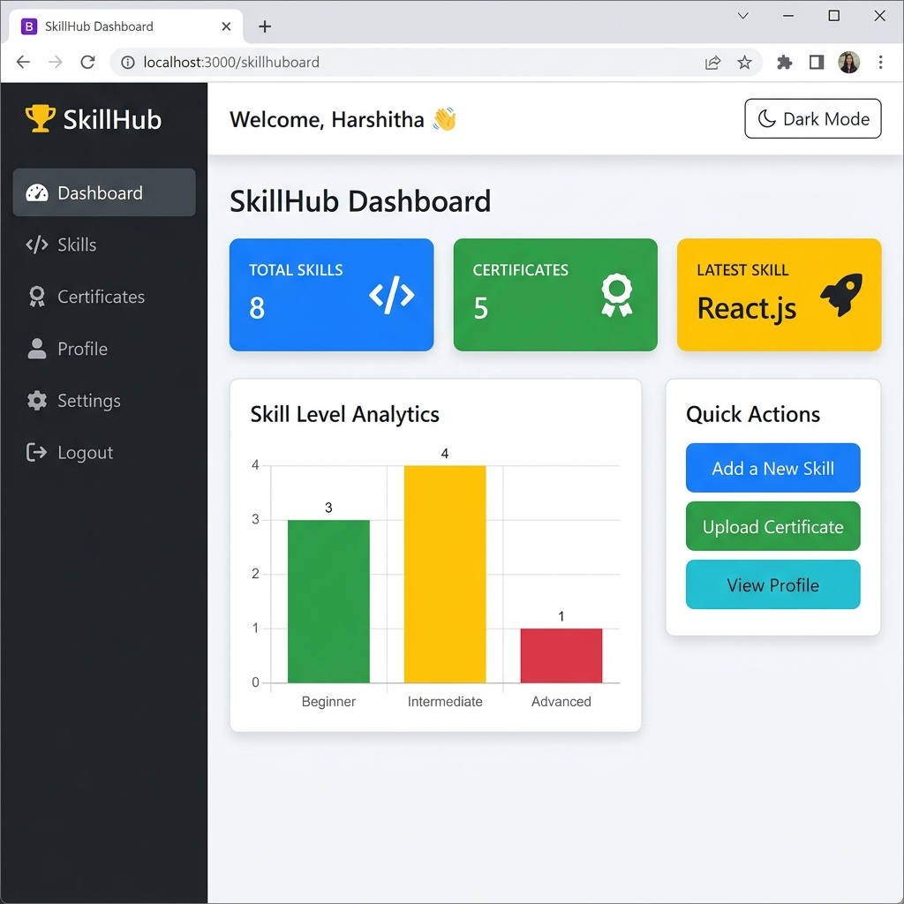
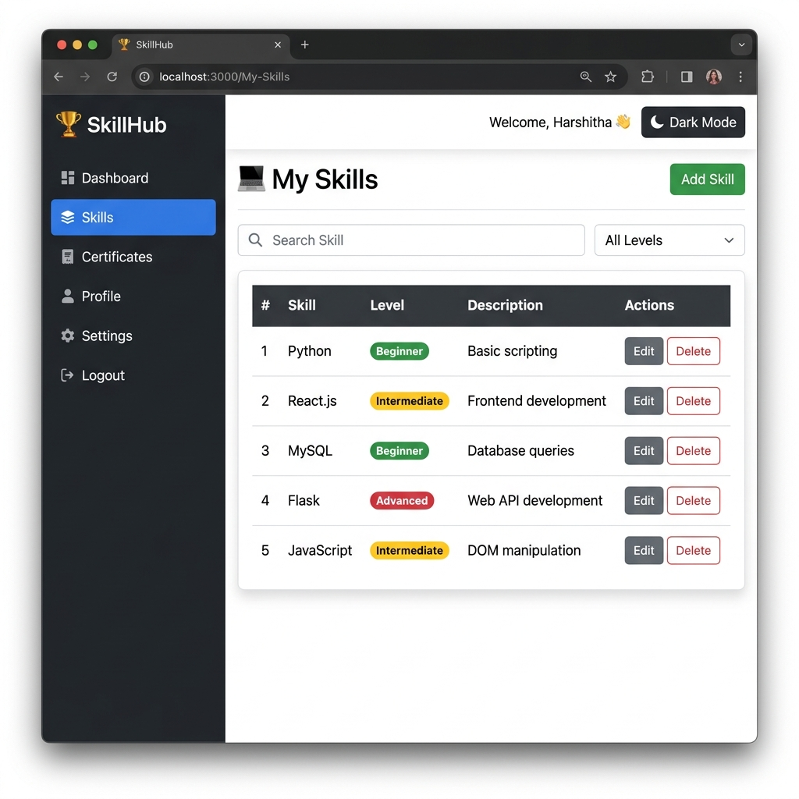
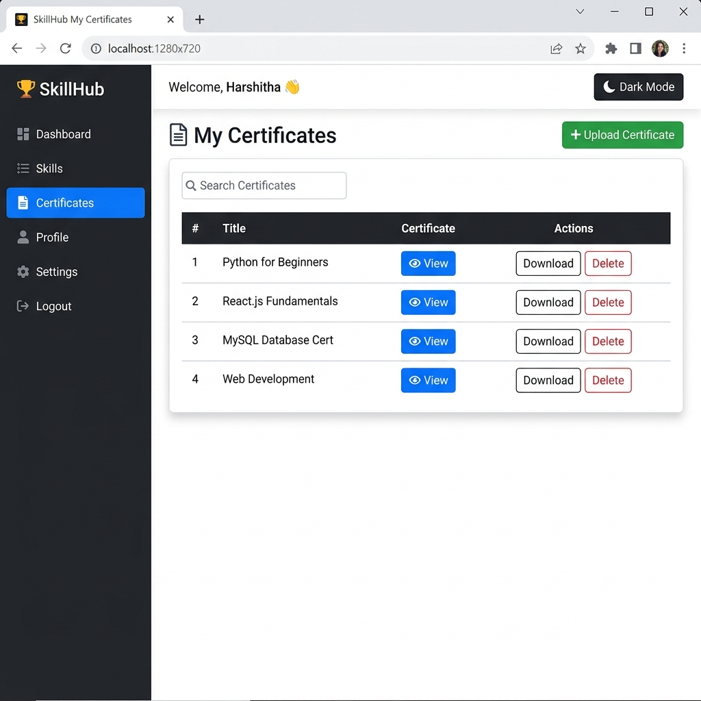
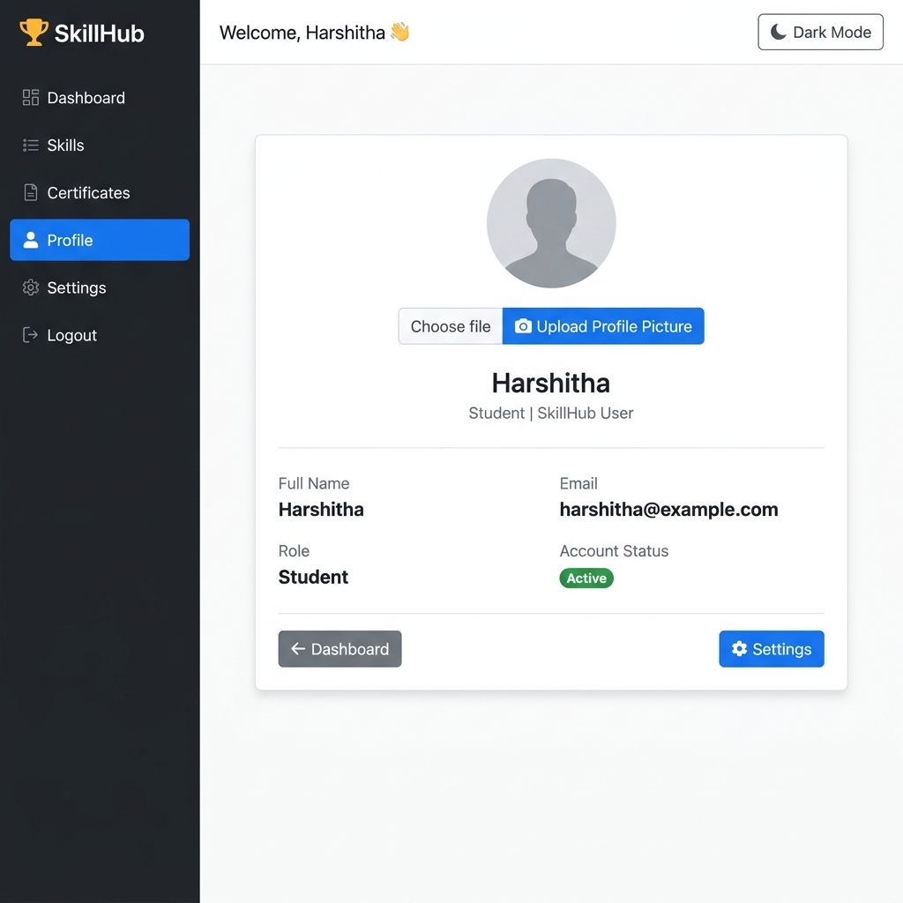

# 🏆 SkillHub

A modern Python Full Stack web application built using **Flask** and **MySQL** that allows users to manage their skills, upload certificates, and track their professional growth through a personalized dashboard.

---

## 📌 Project Overview

SkillHub is a skill management platform designed for students and professionals to organize their technical skills and certificates in one place.

The application provides secure authentication, skill management, certificate uploads, profile management, and dashboard analytics in a clean and responsive interface.

---

## ✨ Features

### 🔐 User Authentication
- User Registration
- Secure Login
- Logout
- Session Management

### 📊 Dashboard
- Total Skills Count
- Total Certificates Count
- Latest Added Skill
- Skill Analytics (Chart.js)
- Quick Action Buttons

### 💻 Skill Management
- Add Skills
- View Skills
- Edit Skills
- Delete Skills

### 📄 Certificate Management
- Upload Certificates
- View Uploaded Certificates
- Delete Certificates

### 👤 User Profile
- View Profile
- Edit Profile
- Profile Picture Support
- User Bio

### ⚙️ Settings
- Change Password (UI)
- Dark Mode Toggle
- Logout
- Delete Account (UI)

### 🎨 User Interface
- Bootstrap 5
- Responsive Design
- Sidebar Navigation
- Dashboard Cards
- Charts using Chart.js

---

## 🛠 Tech Stack

### Frontend
- HTML5
- CSS3
- Bootstrap 5
- JavaScript
- Chart.js
- Jinja2 Templates

### Backend
- Python
- Flask

### Database
- MySQL

### Libraries
- Flask
- Flask-MySQLdb
- python-dotenv
- Werkzeug

---

## 📂 Project Structure

```text
SkillHub/
│
├── app.py
├── config.py
├── requirements.txt
├── README.md
├── .env
│
├── models/
├── routes/
├── templates/
├── static/
│   ├── css/
│   ├── js/
│   ├── images/
│   └── uploads/
│
└── venv/
```

---

## 📸 Screenshots

Add screenshots here after uploading them to GitHub.

### 🏠 Dashboard



---

### 💻 Skills



---

### 📄 Certificates



---

### 👤 Profile



---

### 🔐 Login


---

## ⚙️ Installation

### Clone Repository

```bash
git clone https://github.com/YOUR_USERNAME/SkillHub.git
```

Go to project folder

```bash
cd SkillHub
```

Create Virtual Environment

```bash
python -m venv venv
```

Activate Environment

### Windows

```bash
venv\Scripts\activate
```

### Install Dependencies

```bash
pip install -r requirements.txt
```

Run the application

```bash
python app.py
```

Open

```
http://127.0.0.1:5000
```

---

## 🗄 Database Setup

Create a MySQL database

```sql
CREATE DATABASE skillhub;
```

Select the database

```sql
USE skillhub;
```

Create the required tables (`users`, `skills`, `certificates`) and configure your `.env` file.

Example:

```env
SECRET_KEY=your_secret_key

DB_HOST=localhost
DB_USER=root
DB_PASSWORD=your_password
DB_NAME=skillhub

UPLOAD_FOLDER=static/uploads
```

---

## 🚀 Future Enhancements

- Email Verification
- Forgot Password
- Admin Dashboard
- Skill Search & Filter
- Certificate Download
- Profile Completion Progress
- Notifications
- Cloud File Storage
- REST API
- Docker Support
- Deployment on Render/AWS


## 📄 License

This project is created for learning and portfolio purposes.